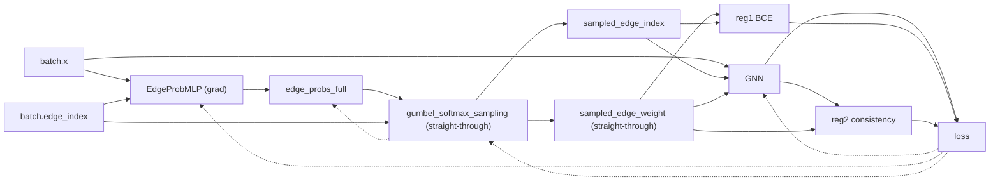
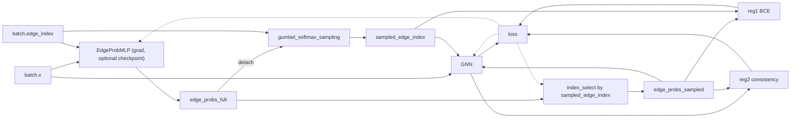
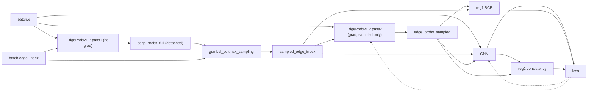

# Instruction

The followings are for Gilbreth command

```bash
conda init bash
source ~/.bashrc


conda activate /home/das90/.conda/envs/cent7/2020.11-py38/py311cu117pyg200
export PATH=/home/das90/.conda/envs/cent7/2020.11-py38/py311cu117pyg200/bin:$PATH

cd GNNcodes/CVE2020/GNN-NC/Graph-Sparsification/SupervisedSparsification/SGSGNNTmlr/

python main.py --dataset SmallCora --mode learned --runs 1 --epochs 250 --save_csv True --edge_mlp_type GCN --GNN GCN --log True --sparse_edge_mlp True --conditional True --reg1 True --reg2 True
```

## Demo run

```bash
#!/usr/bin/env bash
set -euo pipefail

SCRIPT_DIR="$(cd "$(dirname "${BASH_SOURCE[0]}")" && pwd)"
ROOT_DIR="$(cd "${SCRIPT_DIR}/.." && pwd)"

COMMON_ARGS=(
  --dataset Reddit
  --mode learned
  --runs 1
  --epochs 2
  --save_csv True
  --edge_mlp_type GCN
  --GNN GCN
  --log False
  --sparse_edge_mlp True
  --conditional True
  --reg1 True
  --reg2 True
  --stats True
  --hybrid_checkpoint True
)

run_pipeline () {
  local pipeline="$1"
  local log_file="${ROOT_DIR}/pipeline_${pipeline}.log"
  echo "=== Running pipeline: ${pipeline} ==="
  (cd "${ROOT_DIR}" && python main.py "${COMMON_ARGS[@]}" --pipeline "${pipeline}") | tee "${log_file}"
  echo "--- Stats (${pipeline}) ---"
  grep -n "\\[stats\\]" "${log_file}" || true
  echo ""  
}

run_pipeline "two_pass"
run_pipeline "straight_through"
run_pipeline "hybrid"
```

# Mermaid diagram

Below are corrected, syntax‑valid Mermaid diagrams for the three pipelines. I used solid arrows for forward pass and dashed arrows for backward/grad flow. I also annotated the key differences (straight‑through vs detach vs two‑pass recompute).

**Straight‑Through**



**Hybrid**



**Two‑Pass**


